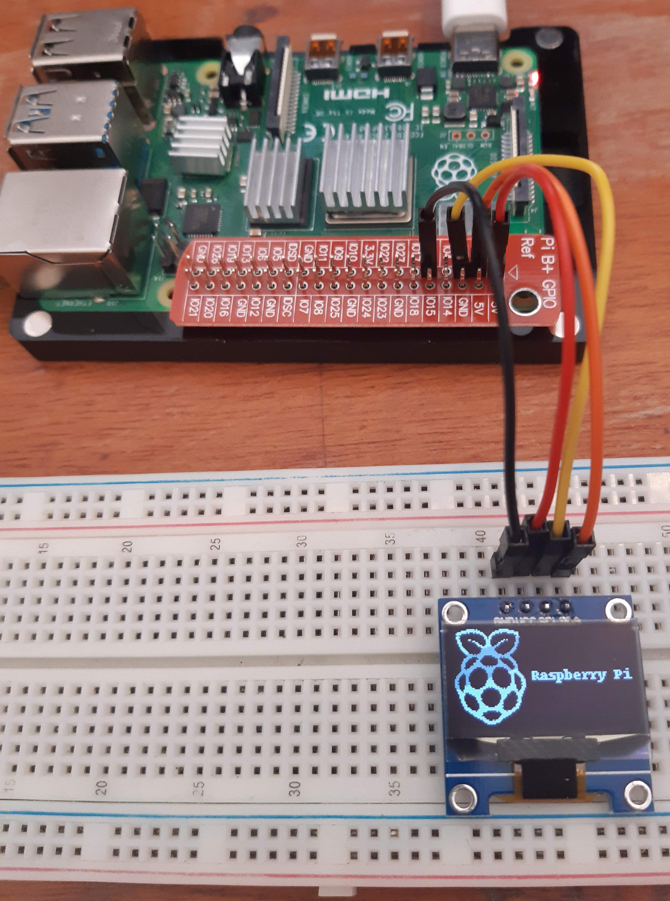

# Raspberry Pi Usage

Breadboard example of a [I2C](https://en.wikipedia.org/wiki/I2C) monochromatic 128x64 OLED display based on the SSD1306 controller:



Enable i2c:

```bash
# NB this changes /boot/config.txt
raspi-config nonint do_i2c 0

# increase the i2c baud rate from the default of 100 KHz to 1 MHz.
# see https://github.com/raspberrypi/firmware/blob/master/boot/overlays/README
sed -i -E 's/^(dtparam=i2c_arm=on).*/\1,i2c_arm_baudrate=1000000/g' /boot/config.txt

# reboot to apply changes.
reboot

# show i2c module information.
modinfo i2c_bcm2835
modinfo i2c_dev
```

Install i2c tools:

```bash
apt-get install -y i2c-tools
```

Detect i2c buses:

```bash
i2cdetect -l
```

In my case, this displayed the single bus `i2c-1`:

```plain
i2c-1	i2c       	bcm2835 I2C adapter             	I2C adapter
```

Detect i2c devices in bus `1`:

```bash
i2cdetect -y 1
```

In my case, this displayed a single device at the `0x3c` address:

```plain
     0  1  2  3  4  5  6  7  8  9  a  b  c  d  e  f
00:          -- -- -- -- -- -- -- -- -- -- -- -- --
10: -- -- -- -- -- -- -- -- -- -- -- -- -- -- -- --
20: -- -- -- -- -- -- -- -- -- -- -- -- -- -- -- --
30: -- -- -- -- -- -- -- -- -- -- -- -- 3c -- -- --
40: -- -- -- -- -- -- -- -- -- -- -- -- -- -- -- --
50: -- -- -- -- -- -- -- -- -- -- -- -- -- -- -- --
60: -- -- -- -- -- -- -- -- -- -- -- -- -- -- -- --
70: -- -- -- -- -- -- -- --
```

Install the [luma.oled](https://github.com/rm-hull/luma.oled) python library:

```bash
apt-get install -y python3-dev python3-pip libfreetype6-dev libjpeg-dev build-essential libopenjp2-7 libtiff5
python3 -m pip install luma.oled
```

Download the rpi logo and resize it to fit the 128x64 oled display resolution:

```bash
# see https://commons.wikimedia.org/wiki/Raspberry_Pi_logos
wget -qO rpi-logo-big.png https://upload.wikimedia.org/wikipedia/commons/0/01/RPi-Logo-White-SCREEN.png
python3 <<'EOF'
from PIL import Image

image = Image.open('rpi-logo-big.png')
image.thumbnail((128, 64), Image.BICUBIC)
image.save('rpi-logo.png', 'PNG')
EOF
```

Show the rpi logo on the oled display:

```bash
python3 <<'EOF'
import time
from luma.core.interface.serial import i2c
from luma.oled.device import ssd1306
from luma.core.render import canvas
from PIL import Image

# NB ssd1306 devices are monochromatic; a pixel is enabled with
#    white and disabled with black.
# NB the ssd1306 class has no way of knowing the device resolution/size.
device = ssd1306(i2c(port=1, address=0x3c), width=128, height=64, rotate=0)

# set the contrast to minimum.
device.contrast(1)

# load the rpi logo.
logo = Image.open('rpi-logo.png')

# show some info.
print(f'device size {device.size}')
print(f'device mode {device.mode}')
print(f'logo size {logo.size}')
print(f'logo mode {logo.mode}')

# NB this will only send the data to the display after this "with" block is complete.
# NB the draw variable is-a PIL.ImageDraw.Draw (https://pillow.readthedocs.io/en/3.1.x/reference/ImageDraw.html).
# see https://github.com/rm-hull/luma.core/blob/master/luma/core/render.py
with canvas(device, dither=True) as draw:
    #draw.rectangle(device.bounding_box, outline='white', fill='black')
    draw.bitmap((0, 0), logo)
    message = 'Raspberry Pi'
    text_size = draw.textsize(message)
    draw.text((device.width - text_size[0], (device.height - text_size[1]) // 2), message, fill='white')

# NB the display will be turn off after we exit this application.
time.sleep(5*60)
EOF
```
